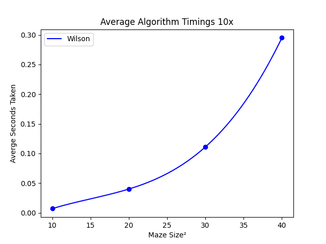

# maze_runner
 Generate, test, and solve mazes

## Algorithms

|Algorithms||| 
|--|--|--|
|Wilson|Randomly walks from random point A to random point B, then starts again from a random point until it touches an existing path. Repeat.|https://en.wikipedia.org/wiki/Maze_generation_algorithm#Wilson's_algorithm|
|Aldous-Brodor|Pick a random neighbour. If not visited, remove wall between current and picked. Mark as visited. Make picked neighbor current. - One of the least efficient algorithms.|https://en.wikipedia.org/wiki/Maze_generation_algorithm#Aldous-Broder_algorithm|
|Depth-first Recursive||

## Benchmarks 

## Visuals 

|Wilson|
||